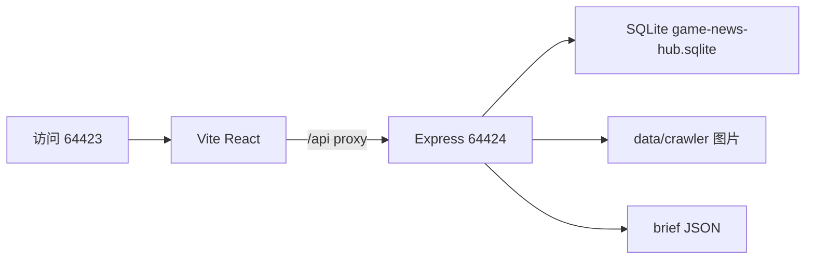
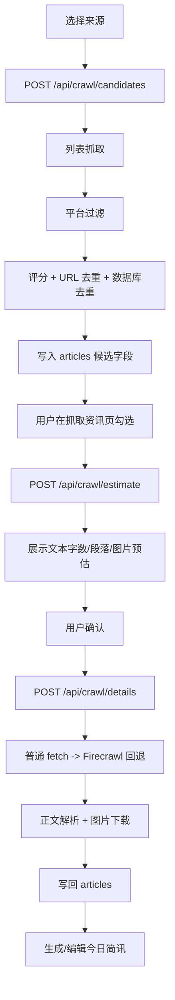

# GameNews 项目分析

## 概览

**定位**：中文游戏资讯聚合、质量筛选、详情采集和简讯编辑工具。

**目标用户**：需要从多个游戏资讯平台快速发现内容、人工确认正文和图片，并整理成每日游戏简讯的运营或编辑人员。

**当前成熟度**：核心抓取、解析、评分、图片存储、简讯生成和前端编辑流程已存在；平台质量和动态页面稳定性仍属于持续优化项。

**交付形态**：本地 Windows 开发工具，前端和后端在同一项目内运行，使用本地 SQLite 和 `data/` 文件存储。

## 技术栈

| 层次 | 当前实现 | 证据 |
|---|---|---|
| 前端 | React 19 + Vite 8 + lucide-react | `package.json`, `src/main.jsx` |
| 后端 | Node.js ESM + Express 5 | `server/index.js` |
| 数据库 | Node `node:sqlite` + SQLite 文件 | `server/database.js` |
| HTML 解析 | Cheerio | `server/crawler/parser.js` |
| 编码处理 | iconv-lite，兼容 GBK/GB18030 | `server/crawler/fetcher.js` |
| 动态回退 | Firecrawl SDK，读取 `FIRECRAWL_API_KEY` | `server/crawler/rateLimiter.js` |
| 定时任务 | node-cron | `server/scheduler.js` |
| 样式 | CSS 变量 + 页面专属 CSS | `src/design-system.css`, `src/styles.css` |

## 目录与关键文件

```text
GameNews/
├─ server/
│  ├─ index.js                 Express API、静态资源和启动入口
│  ├─ database.js              SQLite 建表、查询、文章和简讯持久化
│  ├─ scheduler.js             早报/晚报/周报定时流水线
│  ├─ content/generator.js     标题、导语、正文块和微信 HTML 生成
│  └─ crawler/
│     ├─ tasks.js              候选、估算、详情三类任务
│     ├─ fetcher.js            普通 HTTP 抓取和编码转换
│     ├─ parser.js             列表/详情 HTML 解析与正文清洗
│     ├─ scorer.js             候选评分
│     ├─ deduper.js            稳定 ID、URL 去重和数据库去重
│     ├─ rateLimiter.js        并发限制、Firecrawl 限额和缓存
│     ├─ imageSaver.js         图片下载、校验、哈希去重和落盘
│     ├─ registry.js            内置/自定义来源注册
│     └─ platforms/             各平台 URL 与标题过滤适配器
├─ src/
│  ├─ App.jsx                  hash 路由和懒加载页面
│  ├─ components/AppShell.jsx  侧栏、主题切换和一键生成
│  ├─ pages/DashboardPage.jsx  今日简讯阅读页
│  ├─ pages/FeedPage.jsx       抓取资讯、筛选和详情确认
│  ├─ pages/CrawlerMonitorPage.jsx 爬虫状态、质量分布和来源浏览器入口
│  ├─ pages/BriefPage.jsx      简讯生成、编辑、拖拽和历史
│  └─ services/api.js          前端 API 封装
├─ scripts/
│  ├─ crawler-regression.mjs   固定过滤器和评分回归
│  ├─ fix-quality.mjs          有副作用的数据质量修复脚本
│  └─ optimize-crawler.mjs     全量补抓、降级和清垃圾脚本
├─ data/                       SQLite、JSON、爬虫图片和运行产物
└─ vite.config.js              前端端口和后端代理
```

## 启动与运行路径



### 命令

| 目的 | 命令 |
|---|---|
| 开发前后端 | `npm run dev` |
| 仅前端 | `npm run dev:client` |
| 仅后端 | `npm run dev:server` |
| 构建 | `npm run build` |
| 预览 | `npm run preview` |
| 爬虫回归 | `npm run check:crawler` |

### 端口

- Vite：`127.0.0.1:64423`
- Express：`127.0.0.1:64424`
- CORS 默认来源：`http://127.0.0.1:64423`
- 可通过 `GAME_NEWS_API_PORT` 和 `CLIENT_ORIGIN` 覆盖，但当前默认配置应保持稳定。

## 架构与主流程

### 用户手动流程



### 定时流水线

`server/scheduler.js` 当前还提供自动流程：候选抓取 → 自动选择高分 pending 文章 → 详情抓取 → 生成简讯 → 输出 `data/brief-{label}.json`。这条路径会绕过手动筛选，因此后续方案需要明确它是“后台自动模式”，不能误认为用户手动两阶段流程。

- 每日 08:30：`runPipeline("morning")`
- 每日 17:50：`runPipeline("afternoon")`
- 每周一 08:35：`runWeeklyBrief()`，近 7 天已确认文章按游戏聚合 Top 10

## 前端模块与规则

### 今日简讯 `src/pages/DashboardPage.jsx`

- 读取 `GET /api/daily-brief`。
- 展示标题、日期、候选数量、精选数量、分类统计、导语和资讯卡片。
- 分类顺序：联动活动、版本更新、测试公测、新游上线。
- 支持原文链接、刷新和重新生成。
- 页面名称为“今日简讯”，不再使用“仪表盘”文案。

### 抓取资讯 `src/pages/FeedPage.jsx`

- 首屏加载今日文章和启用来源。
- 支持来源、分类、标题/游戏名筛选。
- 第一阶段抓候选列表；展开文章不会自动抓详情。
- 勾选后先估算详情文本和图片数量，再由用户确认抓详情。
- 已选条目可进入简讯编辑。

### 简讯编辑 `src/pages/BriefPage.jsx`

- 生成简讯、编辑标题/导语/段落。
- 文本块和图片块可拖动排序。
- 历史简讯支持载入、保存和删除。
- 兼容旧结构 `body/imagesBefore/imagesAfter`，并规范为 `sections[].blocks[]`。
- 支持复制富文本、复制 Markdown 和导出 HTML。

### 主题

`src/components/AppShell.jsx` 用 `localStorage.theme` 保存 `light/dark`，并设置 `document.documentElement[data-theme]`。所有页面应使用设计系统变量，不直接写死一套暗色逻辑。

## 后端 API 契约

| 方法 | 路径 | 作用 |
|---|---|---|
| GET | `/api/health` | 健康检查 |
| GET | `/api/sources` | 获取启用来源 |
| POST | `/api/sources` | 添加自定义来源 |
| DELETE | `/api/sources/:id` | 删除自定义来源，内置来源不可删 |
| POST | `/api/crawl/candidates` | 抓候选列表，可传 `sourceIds` |
| POST | `/api/crawl/estimate` | 估算文本/段落/图片，不写库 |
| POST | `/api/crawl/details` | 抓详情、正文和图片并写库 |
| GET | `/api/crawl/status` | 当前为固定空闲状态返回 |
| GET | `/api/crawl/monitor` | 返回运行状态、质量分布、来源统计、最近文章和定时日志 |
| GET | `/api/articles/today` | 获取今日文章 |
| GET | `/api/articles` | 支持 `source/category/q/page/limit/date_from` |
| POST | `/api/articles/:id/review` | 写入人工确认和选段/选图信息 |
| POST | `/api/briefs/generate` | 根据文章生成简讯草稿并保存 |
| GET | `/api/briefs` | 获取历史简讯 |
| POST | `/api/briefs` | 保存或更新简讯 |
| DELETE | `/api/briefs/:id` | 删除历史简讯 |
| POST | `/api/pipeline/run` | 手动触发完整自动流水线 |
| GET | `/api/daily-brief` | 读取 `data/brief-daily.json` |
| GET | `/api/brief/archive/:slot` | 获取某类简讯的可用归档日期 |
| GET | `/api/brief/archive/:slot/:date` | 读取指定日期的简讯归档 |
| GET | `/api/brief/morning` | 读取早报 JSON |
| GET | `/api/brief/afternoon` | 读取晚报 JSON |
| GET | `/api/brief/weekly` | 读取周报 JSON |

**当前待确认**：没有 `POST /api/pipeline/weekly`；`/api/pipeline/run` 也没有显式接收 `morning/afternoon` 参数。后续自动简讯 UI 方案不能假设这两个契约已经存在。

### 爬虫监控

侧栏“爬虫监控”对应 `#/crawler`。页面优先读取 `/api/crawl/monitor`；旧后端尚未重启时，会降级使用 `/api/crawl/status`、文章列表和来源接口显示基础状态。完整监控数据包括当前操作、阶段、事件、文章质量分布、来源成功/失败统计、最近文章和 `data/logs/cron-result.json` 中的定时流水线记录。

## 数据与持久化

### SQLite 表

| 表 | 用途 | 重要字段 |
|---|---|---|
| `sources` | 来源配置 | `id/name/urls/access_policy/detail_policy/enabled` |
| `articles` | 候选和详情文章 | `title/game_name/detail_url/score/paragraphs/images_json/quality/review_status` |
| `briefs` | 简讯草稿和历史 | `title/lead/sections_json/total_characters/reading_minutes/status/slot` |

项目没有新增业务表。`briefs.slot` 用于区分 daily、morning、afternoon 和 weekly 简讯，`saveBrief()` 已将其持久化。

### 数据保留策略

- `articles` 仅作为最近 48 小时资讯池，流水线阶段按 `discovered_at` 清理超期文章。
- `daily` 简讯按日期长期留档，不依赖文章记录继续存在。
- 非 daily 简讯数据库记录继续按现有 14 天策略清理；文件归档用于保留可读取的历史输出。
- 当前服务处于爬虫暂停维护状态，因此不会自动执行历史清理；恢复流水线后生效。

### 图片

详情图片保存到：

```text
data/crawler/detail-batches/<batchId>/images/
```

数据库 `articles.images_json` 保存图片元数据，包含本地 `src`、原始 URL、类型、宽高、大小、MIME 和 SHA-1。前端通过 `/crawler-assets/...` 访问。

### 质量状态

- `pending`：只有候选基础字段，等待详情抓取。
- `verified`：正文长度、游戏名匹配和事件信号都满足条件。
- `needs_review`：有正文但需要人工确认。
- `low_quality`：正文不足或缺少有效信号。
- `failed`：详情任务失败。

人工确认写入 `review_status='confirmed'`，并保存选中的段落/图片 ID。

## 爬虫与清洗规则

### 来源

内置来源定义在 `server/crawler/registry.js`：

- 好游快爆：热点资讯、社区、时间线
- TapTap：热门论坛、游戏日历、即将上线
- 九游：新闻资讯、开测表
- 游民星空、机核、游侠网：资讯页
- Steam：Feature Categories API

可通过 `data/crawler/sources.json` 添加自定义来源；固定来源不能通过自定义列表覆盖。

### 列表过滤

`server/crawler/parser.js` 按 `urlType` 选择提取器，再调用平台 `contentFilter()`。通用噪声包括下载客户端、攻略、礼包、论坛、登录、排行榜、兑换码等。

好游和 TapTap 重点排除：论坛帖、讨论/社区、评分卡、排行/推荐、玩家评价、抽奖/开奖、礼包/兑换码、预约人数/下载量等。正常上线、测试、版本更新、公告、赛季、联动等标题才有机会保留。

### 评分

`server/crawler/scorer.js` 初始分 `50`，最终限制在 `10-95`：

- 事件信号 `+10`
- 书名号游戏名 `+10`
- 官方/正式/公告等 `+5`
- 有日期 `+5`
- 手游来源 `+12`
- 折扣 `-35`
- 论坛 `-20`
- 排行/评分/合集 `-15`
- 预约人数/下载量/人气值 `-12`
- 抽奖 `-25`
- 纯英文标题 `-18`
- 无书名号和游戏标识 `-6`
- 无日期 `-2`
- BBS URL `-25`，`bbs.` 子域名 `-15`

评分只用于排序和流水线筛选，不能替代人工确认。

### 抓取与回退

- 普通请求使用 `fetchHtml()`，15 秒超时，自动识别 UTF-8/GBK/GB18030。
- 并发上限为 3 个任务。
- Firecrawl 仅在配置 `FIRECRAWL_API_KEY`、未超过每日 50 次、且普通解析结果无候选或质量低时使用。
- Firecrawl 结果按 URL 缓存，失败降级为普通抓取失败，不阻断整批任务。

### 详情解析

- 先清理 `script/style/noscript/nav/footer/aside/form`。
- 根据域名选择正文选择器。
- 段落最少 20 字，过滤广告、二维码、相关推荐、责任编辑等噪声，最多 20 段。
- TapTap 没有正文时使用 `og:description`，并清理“TapTap 提供……官方正版下载”前缀。
- 图片最多解析 8 张，记录相对正文位置；好游详情目前不返回正文图片。

### 图片下载

`imageSaver.js` 对每张图片执行：协议检查、类型检查、20KB 至 6MB 大小限制、最小 480x270 尺寸、SHA-1 去重和 MIME 扩展名处理。单图失败会被隔离，不能让文章详情失败。

## 外部依赖与环境

- Firecrawl SDK：需要外部 `FIRECRAWL_API_KEY`，禁止写入代码、日志或文档。
- 新闻站点：页面结构、反爬、HTTP 状态和编码均可能变化。
- 图片 CDN：可能拒绝 Node 请求、返回非图片或返回小图。
- SQLite：运行时会创建/使用 `data/game-news-hub.sqlite` 和 WAL 文件。

## 测试与验证

### 已有验证

- `npm run build`：已通过。
- `npm run check:crawler`：固定 8 个过滤样例和评分分层回归。
- API 健康检查：前端 `64423` 和后端 `64424/api/health` 已验证可访问。

### 回归样例

`scripts/crawler-regression.mjs` 覆盖：

- 好游论坛、评分卡、抽奖、正常资讯
- TapTap 论坛、评分卡、抽奖、正常公告
- 正常资讯分数高于论坛/抽奖，且分数边界在 10-95

### 未完成或需要补强

- `crawlStatus()` 当前返回固定 `active:false`，不是实际任务状态。
- Playwright Chromium 在最近一次验证中缺失，浏览器截图验收仍需补做。
- 没有正式单元测试框架、API 集成测试和图片下载专门测试。
- 真实站点的数量和质量会随页面变化，不应只以 HTTP 200 判断成功。

## 风险与待确认项

| 优先级 | 风险/问题 | 影响 |
|---|---|---|
| 高 | 定时流水线自动抓详情，绕过用户手动筛选 | 和“两阶段抓取”产品规则冲突 |
| 高 | `saveBrief()` 未独立持久化 `slot` | 早报/晚报/周报历史查询可能混淆 |
| 高 | `/api/pipeline/run` 没有类型参数 | 前端无法可靠触发指定时段简讯 |
| 中 | TapTap/好游页面结构和 Firecrawl 返回结构可能变化 | 候选数、正文和图片质量波动 |
| 中 | 清洗脚本会直接更新 SQLite | 误清洗时影响历史数据，执行前必须备份 |
| 中 | `data/` 既有数据库又有输出文件和图片 | 需要明确保留、清理和备份策略 |
| 低 | 前端主题、自动刷新和后端定时任务没有统一状态源 | 用户看到的数据时间可能不同步 |

## 新人阅读路径

1. `package.json`、`vite.config.js`：确认命令、依赖和端口。
2. `server/index.js`、`src/App.jsx`：确认前后端入口和页面路由。
3. `server/database.js`：理解文章、来源、简讯持久化结构。
4. `server/crawler/tasks.js`：理解候选/估算/详情任务边界。
5. `server/crawler/parser.js`、`platforms/`、`scorer.js`：理解清洗、平台过滤和评分。
6. `src/pages/FeedPage.jsx`：理解人工筛选和两阶段交互。
7. `server/content/generator.js`、`src/pages/BriefPage.jsx`：理解简讯生成和编辑。
8. `server/scheduler.js`：最后阅读自动流水线，注意它和手动流程的差异。
